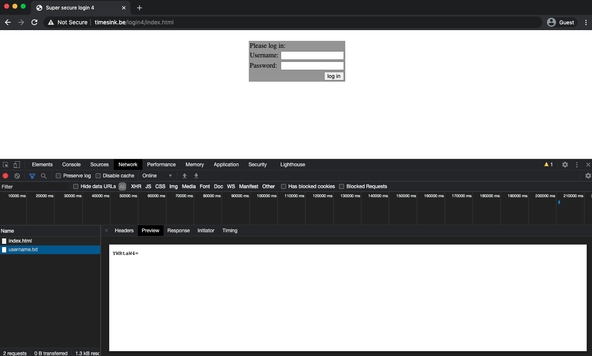
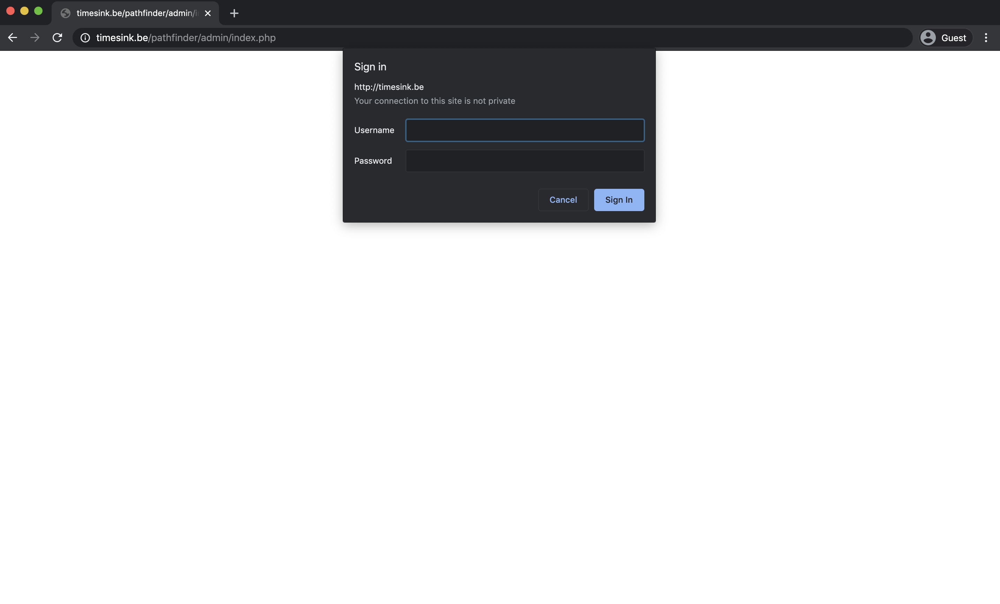

# Brixel CTF 2020

## Overview
|Challenge Name|Points|Category|Flag|
|:--------------:|:------:|:------:|:---------|
|Sea code|5|Cryptography|brixelCTF{SEAGULL}|
|Merde|5|Cryptography|brixelCTF{baguette}|
|Merda|5|Cryptography|brixelCTF{pizzanapoli}|
|login1|5|Internet|brixelCTF{w0rst_j4v4scr1pt_3v3r!}|
|login2|5|Internet|brixelCTF{st1ll_b4d_j4v45cr1pt_h3r3.18079054270}|
|login3|5|Internet|brixelCTF{n0t_3v3n_cl05e_t0_s3cur3!}|
|login4|5|Internet|brixelCTF{even_base64_wont_make_you_secure}|
|A song...|10|Programming|brixelCTF{5667236346614}|
|Scheiße|10|Cryptography|brixelCTF{sauerkraut}|
|Pathfinders #1|15|Internet|brixelCTF{unsafe_include}|
|Pathfinders #2|20|Internet|brixelCTF{outdated_php}|

---

## Sea code
*Points: 5*
<br/>
Category: <kbd>Cryptography</kbd>

### Challenge Description
> beep beep beeeep...
This one should be fairly straight forward

### Attachment
> [message.wav](Files/message.wav)

### Solution
This audio file sounds like morse code, so this challenge can be solved by passing the file into an online [morse code decoder](https://morsecode.world/international/decoder/audio-decoder-adaptive.html).

Analyze the audio file by clicking "**Upload**" and upload the "message.wav" file. After the file is uploaded, click "**Play**" and let it analyze to file until it stops.


The decoder outputs:

> THE FLAG FOR THIS CHALLENGE IS SEAGULL

### Flag: ```brixelCTF{SEAGULL}```

---

## Merde

*Points: 5*
<br/>
Category: <kbd>Cryptography</kbd>

### Challenge Description
> A french messenger was caught during the war
<br/><br/>
He was carrying a piece of paper that read: Vvr ktdk vl jvtzsyHBI{fnzcievs}
<br/><br/>
Upon torturing the messenger for an explaination, he only shouted 'confidentiel'!!!
Too bad he died, I bet something good was in that message

### Solution
In this challenge, the ciphertext is "Vvr ktdk vl jvtzsyHBI{fnzcievs}", and we can assume that the key is "confidentiel".

To decrypt this text, we can try to use a popular cryptographic technique called [Vigenère cipher](https://pages.mtu.edu/~shene/NSF-4/Tutorial/VIG/Vig-Base.html).

We can utilize an online [Vigenère cipher decoder](https://cryptii.com/pipes/vigenere-cipher) to decrypt this string by clicking "**DECODE**", pasting "Vvr ktdk vl jvtzsyHBI{fnzcievs}" into the "**Ciphertext**" box and "confidentiel" into the "**Key**" box.


The decrypted output is:

> The flag is brixelCTF{baguette}

### Flag: ```brixelCTF{baguette}```

---

## Merda

*Points: 5*
<br/>
Category: <kbd>Cryptography</kbd>

### Challenge Description
> An Italian messenger was caught during the war
<br/><br/>
He was carrying a piece of paper that read: ymj kqfl nx gwncjqHYK{uneefsfutqn}
<br/><br/>
Upon torturing the messenger for an explaination, he gestured a V with his fingers. The english guard took it as an insult and killed him right on the spot.
<br/><br/>
Maybe he just wanted some peace?

### Solution
In this challenge, the ciphertext is "ymj kqfl nx gwncjqHYK{uneefsfutqn}", and we can assume that "V (5)" is the shift.

To decrypt this text, we can try to use a popular cryptographic technique called [Caesar cipher](https://www.cs.mcgill.ca/~rwest/wikispeedia/wpcd/wp/c/Caesar_cipher.htm).

We can utilize an online [Caesar cipher decoder](https://cryptii.com/pipes/caesar-cipher) to decrypt this string by clicking "**DECODE**", pasting "ymj kqfl nx gwncjqHYK{uneefsfutqn}" into the "**Ciphertext**" box and set the "**Shift**" to "5".


The decrypted output is:

> the flag is brixelCTF{pizzanapoli}

### Flag: ```brixelCTF{pizzanapoli}```

---

## login1

*Points: 5*
<br/>
Category: <kbd>Internet</kbd>

### Challenge Description
> My buddy is trying to become a web developer, he made this little login page. Can you get the password?
<br/><br/>
http://timesink.be/login1/index.html

### Solution

Right click on the webpage and select "View Page Source".

``` Javascript
<script type="text/javascript">
	function verify() {
		password = document.getElementById("the_password").value;
		if(password == "brixelCTF{w0rst_j4v4scr1pt_3v3r!}")
		{
			alert("Password Verified");
		}
		else
		{
		alert("Incorrect password");
		}
	}
</script>
```

Viewing the JavaScript section of the HTML code, the code reveals the password (which is also the flag).

### Flag: ```brixelCTF{w0rst_j4v4scr1pt_3v3r!}```

---

## login2

*Points: 5*
<br/>
Category: <kbd>Internet</kbd>

### Challenge Description
> Cool, you found the first password! He secured it more, could you try again?
<br/><br/>
http://timesink.be/login2/index.html

### Solution

Right click on the webpage and select "View Page Source".

``` Javascript
<script type="text/javascript">
	function verify() {
		password = document.getElementById("the_password").value;
		split = 6;
		if (password.substring(0, split) == 'brixel')
		{
			if (password.substring(split*6, split*7) == '180790')
			{
				if (password.substring(split, split*2) == 'CTF{st')
				{
					if (password.substring(split*4, split*5) == '5cr1pt')
					{
						if (password.substring(split*3, split*4) == 'd_j4v4')
						{
							if (password.substring(split*5, split*6) == '_h3r3.')
							{
								if (password.substring(split*2, split*3) == '1ll_b4')
								{
									if (password.substring(split*7, split*8) == '54270}')
									{
										alert("Password Verified")
									}
								}
							}
						}
					}
				}
			}
		}
		else
		{
		alert("Incorrect password");
		}
	}
</script>
```

Viewing the JavaScript section of the HTML code, we can see that the code is checking the substrings of the password the user enters with the actual password. To complete this challenge, put together the substrings of the actual password.

### Flag: ```brixelCTF{st1ll_b4d_j4v45cr1pt_h3r3.18079054270}```

---

## login3

*Points: 5*
<br/>
Category: <kbd>Internet</kbd>

### Challenge Description
> Nice! you found another one! He changed it up a bit again, could you try again?
<br><br/>
http://timesink.be/login3/index.html

### Solution

Right click anywhere on the website and select "Inspect", then go to "Network".


Click the "log in" button, without entering any credentials on the website.


A "username.txt" file will appear in the Network section, click on it to view it. The content of "username.txt" is:
> admin

Enter "**admin**" as the username and leave the password field blank, then click the "log in" button.


A "password.txt" file will appear in the Network section, click on it to view it. The content of "password.txt" is:
> brixelCTF{n0t_3v3n_cl05e_t0_s3cur3!}

### Flag: ```brixelCTF{n0t_3v3n_cl05e_t0_s3cur3!}```

---

## login4

*Points: 5*
<br/>
Category: <kbd>Internet</kbd>

### Challenge Description
> Whow, another one! You're good! So I told my buddy how you managed to get the password last time, and he fixed it. Could you check again please?
<br><br/>
http://timesink.be/login4/index.html

### Solution

Right click anywhere on the website and select "Inspect", then go to "Network".


Click the "log in" button, without entering any credentials on the website.



A "username.txt" file will appear in the Network section, click on it to view it. The content of "username.txt" is:
> YWRtaW4=

The "=" indicates that the string could possibly be encoded in base64.
``` bash
$ echo "YWRtaW4=" | base64 --decode
admin
```

Enter "**admin**" as the username and leave the password field blank, then click the "log in" button.


A "password.txt" file will appear in the Network section, click on it to view it. The content of "password.txt" is:
> YnJpeGVsQ1RGe2V2ZW5fYmFzZTY0X3dvbnRfbWFrZV95b3Vfc2VjdXJlfQ==
``` bash
$ echo "YnJpeGVsQ1RGe2V2ZW5fYmFzZTY0X3dvbnRfbWFrZV95b3Vfc2VjdXJlfQ==" | base64 --decode
brixelCTF{even_base64_wont_make_you_secure}
```

### Flag: ```brixelCTF{even_base64_wont_make_you_secure}```

---

## A song...

*Points: 10*
<br/>
Category: <kbd>Programming</kbd>

### Challenge Description
> I wrote this song
<br/><br/>
it seems I'm pretty bad at it, but hey! it could get you a flag
>> (intro) <br/>
Shout "brixelCTF{" !!!
<br/><br/>
Brixel is a hackerspace
It's not like any other place
<br/><br/>
Your skill is hopefully the best <br/>
This CTF is the test <br/>
put your skill into the test <br/>
(-and-) let your score be "blessed"
<br/><br/>
(chorus)
The challenges are serious <br/>
Your skill is mysterious <br/>
Build your skill up, up, up (-up,up-) <br/>
Knock the challenges down <br/>
your skill is true, <br/>
your skill is right! <br/>
Knock the challenges down <br/>
your score is taking flight!
<br/><br/>
(verse1)
put This CTF into your skill <br/>
put Brixel into your Heart (-or not, hey! just chill!-)
<br/><br/>
the hype is getting to the top, <br/>
the beat is ready to drop, <br/>
build the hype up! <br/>
build the hype up! <br/>
build the hype up!
<br/><br/>
whisper the challenges, <br/>
say your score, <br/>
Shout the hype, (-and-) <br/>
SCREAM YOUR SKILL! (-m-M-M-MONSTERKILL!!-)
<br/><br/>
(chorus)
The challenges are serious <br/>
Your skill is mysterious <br/>
Build your skill up, up, up (up,up) <br/>
Knock the challenges down <br/>
your skill is true, <br/>
your skill is right! <br/>
Knock the challenges down <br/>
your score is taking flight!
<br/><br/>
(verse2)
Happy Holidays is a wish, <br/>
Brixel is wishing you today <br/>
Santa is now leaving <br/>
(-riding on his sleigh-)
<br/><br/>
This was fun <br/>
This was grand <br/>
Turn up your score <br/>
Turn up your skill
<br/><br/>
put your heart into your skill <br/>
put your skill into the test <br/>
say your score (-because you ARE the best-)
<br/><br/>
Say Happy Holidays <br/>
Say Brixel and "}"
<br/><br/>
(fin) <br/>

### Hint

> It would be a pretty bad song wouldn't it? it's actually code! search for a programming language that uses lyrics

### Solution

[Rockstar](https://github.com/RockstarLang/rockstar) is a programming language that uses lyrics. Use an online [Rockstar compiler](https://codewithrockstar.com/online) to compile the lyrics.

Copy and paste the lyrics into the first box at the top then click "Rock!" to compile the code.


### Flag: ```brixelCTF{5667236346614}```

---

## Scheiße

*Points: 10*
<br/>
Category: <kbd>Cryptography</kbd>

### Challenge Description
> A german messenger was caught during WW2
<br/><br/>
He was carrying a piece of paper that read: qbhbh zrmua gfbld ocqbv
<br/><br/>
He was nice enough to give us all we wanted, except the decoded message, he needs a special machine for that, and we don't have it.
<br/><br/>
He DID give us the settings for the machine.
<br/><br/>
The settings for this machine are:
<br/><br/>
Model: G-312
<br/><br/>
Reflector: UKW 11/26
<br/><br/>
Rotor 1: 2/12/6
<br/><br/>
Rotor 2: 1/17/16
<br/><br/>
Rotor 3: 3/12/1
<br/><br/>
The flag is ONE word, no spaces. do NOT translate the flag!

### Solution

The cipher is encrypted using [Enigma machine](https://brilliant.org/wiki/enigma-machine/), so to decrypt the text, use an online [Enigma machine decoder](https://cryptii.com/pipes/enigma-machine).

Click "**DECODE**" and paste "qbhbh zrmua gfbld ocqbv" into the "**Ciphertext**" box, then configure the following:
1. **MODEL:** Abwehr Enigma G-312
2. **REFLECTOR:** UKW
    * **POSITION:** 11
    * **RING:** 26
3. **ROTOR 1:** II
    * **POSITION:** 12
    * **RING:** 6
4. **ROTOR 2:** I
    * **POSITION:** 17
    * **RING:** 16
5. **ROTOR 3:** III
    * **POSITION:** 12
    * **RING:** 1


The decrypted output is:
> derfl agist sauer kraut

### Flag: ```brixelCTF{sauerkraut}```

---

## Pathfinders #1

*Points: 15*
<br/>
Category: <kbd>Internet</kbd>

### Challenge Description
> These f*cking religious sects!
<br/><br/>
These guys brainwashed my niece into their demeted world of i-readings and other such nonsense.
<br/><br/>
The feds recently closed their churches, but it seems they are preparing for a new online platform to continue their malicious activities.
<br/><br/>
can you gain access to their admin panel to shut them down?
<br/><br/>
Their website is: http://timesink.be/pathfinder/

### Solution

It seems like `/admin` directory is locked using `.htpasswd`.



Access `http://timesink.be/pathfinder/index.php?page=admin/.htpasswd` to reveal the flag.


### Flag: ```brixelCTF{unsafe_include}```

---

## Pathfinders #2

*Points: 20*
<br/>
Category: <kbd>Internet</kbd>

### Challenge Description
> It seems they updated their security. can you get the password for their admin section on their new site?
<br/><br/>
http://timesink.be/pathfinder2/
<br/><br/>
oh yeah, let's assume they are running a php version below 5.3.4 here...

### Solution

It seems like `/admin` directory is locked using `.htpasswd` and we can utilize the [php vulnerability](https://www.cvedetails.com/cve/CVE-2006-7243/) to bypass the login.

Access `http://timesink.be/pathfinder2/index.php?page=admin/.htpasswd%00.php` to reveal the flag.


### Flag: ```brixelCTF{outdated_php}```
